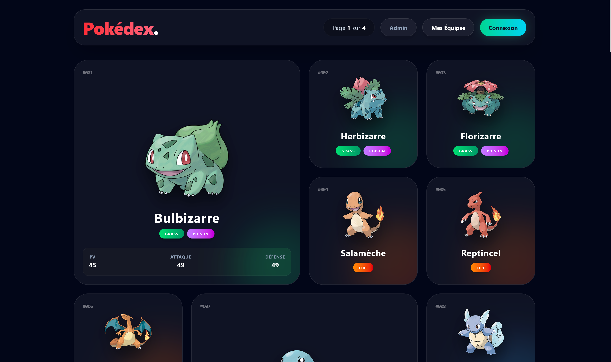

# Pokédex Full-Stack 



Une application web complète permettant de consulter un Pokédex, de créer un compte dresseur, de composer ses propres équipes de Pokémon et d'administrer la base de données.

🎥 **[Voir la démonstration vidéo du projet](https://youtu.be/tAdlDhXaBEo)**

---

## 🛠 Technologies utilisées
### Backend (API REST)
* Node.js & Express.js
* MongoDB & Mongoose
* JSON Web Token (JWT) pour l'authentification
* Bcrypt pour le hachage des mots de passe
* CORS

### Frontend (Client)
* React.js (via Vite)
* Tailwind CSS V4 (Glassmorphism UI)
* React Router DOM (Navigation)
* Axios (Client HTTP)

---

## 📋 Prérequis
Avant de commencer, assurez-vous d'avoir installé sur votre machine :
* Node.js (v18 ou supérieure recommandée)
* Git
* Une instance MongoDB en cours d'exécution (locale ou MongoDB Atlas)

---

## 🚀 Installation et Lancement
Le projet utilise une structure "Monorepo" où le backend est à la racine et le frontend dans le dossier `pokedex-front`. Vous devrez lancer deux terminaux en parallèle.

### 1. Cloner le projet
Ouvrez un terminal et exécutez les commandes suivantes :

```bash
git clone https://github.com/zkerkeb-class/tp-nosql-LucasGYnov
cd tp-nosql-LucasGYnov

```

### 2. Configuration du Backend (API)

Restez à la racine du projet pour installer les dépendances du serveur Node.js :

```bash
npm install

```

Créez un fichier `.env` à la racine du projet et ajoutez les variables suivantes :

```env
PORT=3000
MONGODB_URI=mongodb://localhost:27017/pokemons
API_URL=http://localhost:3000
JWT_SECRET=cle_jwt_super_secrete

```

Importez les 151 premiers Pokémon dans votre base de données en exécutant le script de "seed" :

```bash
npm run seed

```

Lancez le serveur backend de développement :

```bash
npm run dev

```

L'API sera disponible sur `http://localhost:3000`.

### 3. Configuration du Frontend (React)
Ouvrez un **deuxième terminal**, placez-vous dans le dossier front-end et installez les dépendances :

```bash
cd pokedex-front
npm install

```

Lancez le serveur frontend de développement :

```bash
npm run dev

```

L'application web sera accessible sur `http://localhost:5173`.

---

## 📦 Dépendances Principales
Si vous souhaitez recréer le projet de zéro, voici les commandes d'installation exactes utilisées.

### Backend
```bash
npm install express mongoose dotenv cors bcrypt jsonwebtoken
npm install -D nodemon

```

### Frontend
```bash
npm install react-router-dom axios
npm install -D tailwindcss @tailwindcss/vite

```

---

## 🗺️ Architecture de l'API (Routes)
* `GET /api/pokemons` : Liste paginée des Pokémon
* `GET /api/pokemon/:id` : Détails d'un Pokémon spécifique
* `POST /api/auth/register` : Inscription d'un dresseur
* `POST /api/auth/login` : Connexion (Retourne un JWT)
* `GET /api/teams` : Liste des équipes de l'utilisateur (Protégé)
* `POST /api/teams` : Créer une équipe (Protégé)
* `PUT /api/teams/:id` : Modifier une équipe / Ajouter un Pokémon (Protégé)
* `DELETE /api/teams/:id` : Supprimer une équipe (Protégé)
* `PUT /api/pokemon/:id` : Éditer les informations d'un Pokémon (Protégé / Admin)
* `DELETE /api/pokemon/:id` : Supprimer un Pokémon (Protégé / Admin)

---

## 💡 Fonctionnalités de l'interface
* **Pokédex complet :** Grille Bento avec pagination, affichage des types dynamiques.
* **Authentification :** Création de compte et connexion sécurisée par Token.
* **Espace "Mes Équipes" :** Création d'équipes et ajout jusqu'à 6 Pokémon par équipe.
* **Détails Pokémon :** Vue détaillée avec barre de progression des statistiques et bascule Sprite Normal/Shiny.
* **Panneau Admin :** Tableau de bord pour éditer les statistiques ou supprimer des Pokémon de la base de données.